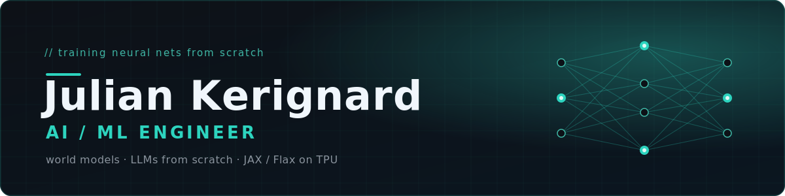
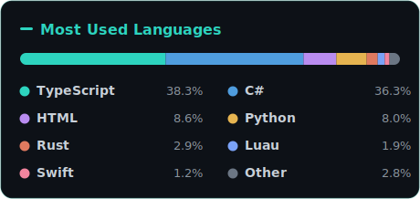

<div align="center">

<picture>
  <source media="(prefers-color-scheme: dark)" srcset="./assets/hero-dark.svg">
  <source media="(prefers-color-scheme: light)" srcset="./assets/hero-light.svg">
  
</picture>

<br />

[](https://huggingface.co/JulianKrgd)
[](https://juliankerignard.fr)
[](https://www.linkedin.com/in/julian-kerignard-b9ab6a2bb)

</div>

---

## About

I train neural networks **from scratch**, mostly in **JAX / Flax**. Two lines of work:

- **Language models** — the *Julian* family: bilingual (EN / FR) LLMs, from raw data to instruction-tuned chat, on TPU.
- **World models** — *oneiro*: a from-scratch DreamerV3 agent that learns its entire policy inside the imagined rollouts of its own world model.

## World model — oneiro

<div align="center">

<br />
<sub>oneiro (~64k env steps) unlocking achievements in Crafter — learned entirely from imagination rollouts</sub>
</div>

A from-scratch reimplementation of [**DreamerV3**](https://arxiv.org/abs/2301.04104) (Hafner et al., 2023) in **JAX / Flax NNX**, trained on the [Crafter](https://github.com/danijar/crafter) benchmark (sparse rewards, 64×64 pixels, 22 hierarchical achievements).

- **15.26M parameters** — DreamerV3-S class
- **Rainbow-level in 64k env steps**: 4.0 achievements/episode, vs Rainbow's 4.3 at **1M** steps — a ~16× sample-efficiency gap
- RSSM + imagination-based actor-critic, GPU-resident replay buffer, `lax.scan` everywhere
- **18+ documented training runs** with full debugging journals and a hypothesis registry — the real value of the repo

→ [**JulianKerignard/oneiro**](https://github.com/JulianKerignard/oneiro)

## Language models — the Julian family

```
Wikipedia EN/FR dumps  →  clean / tokenize (SentencePiece)  →
pretrain (JAX · Flax · Optax · FSDP on TPU)  →  SFT / instruct (ChatML)  →  ship on the Hub
```

| Model | Params | Training | Type |
|-------|:------:|----------|------|
| [**Julian-600M-40B**](https://huggingface.co/JulianKrgd/Julian-600M-40B) | 600M | 40B tokens, LLaMA-style, JAX/TPU | Base |
| [**julian-600m-40b-instruct**](https://huggingface.co/JulianKrgd/julian-600m-40b-instruct-sft100k) | 600M | SFT 30k / 100k · ChatML | Instruct |
| [julian-600m-10b](https://huggingface.co/JulianKrgd/julian-600m-10b) | 600M | 10B tokens, earlier run | Base |
| [JULIAN-100M](https://huggingface.co/JulianKrgd/JULIAN-100M) / [Instruct](https://huggingface.co/JulianKrgd/JULIAN-100M-Instruct) | 100M | first generation, GPT-style | Base + Instruct |

Plus a write-up of the whole thing: [**julian-600m-paper**](https://huggingface.co/JulianKrgd/julian-600m-paper).

**Datasets I built & published:** [wikipedia-en-julian](https://huggingface.co/datasets/JulianKrgd/wikipedia-en-julian) &nbsp;·&nbsp; [wikipedia-fr-julian](https://huggingface.co/datasets/JulianKrgd/wikipedia-fr-julian) — the bilingual pretraining corpus.

## Other work

| Project | What it is |
|---------|------------|
| [**Unity-Skills**](https://github.com/JulianKerignard/Unity-Skills) | 18 AI-powered skills for Unity 6+ — works with Claude Code, Cursor, Windsurf, Codex & Gemini CLI |

## Training stack


## Tooling & systems

- **Model Context Protocol servers** — [Blender](https://github.com/JulianKerignard/Blender_MCP) · [Unity](https://github.com/JulianKerignard/MCP-Unity) · [Obsidian](https://github.com/JulianKerignard/MCP-obsidian) · [Trello](https://github.com/JulianKerignard/Trello_MCP) · [webcheck](https://github.com/JulianKerignard/mcp-webcheck)
- [ClawdEngine_Rust](https://github.com/JulianKerignard/ClawdEngine_Rust) — a 3D engine in Rust &nbsp;·&nbsp; [StatsMonitor_MacOS](https://github.com/JulianKerignard/StatsMonitor_MacOS) — Swift

## Languages

<div align="center">



</div>

<!-- Contribution snake — generated by .github/workflows/snake.yml, committed to the `output` branch -->
<div align="center">

<picture>
  <source media="(prefers-color-scheme: dark)" srcset="https://raw.githubusercontent.com/JulianKerignard/JulianKerignard/output/github-snake-dark.svg">
  <source media="(prefers-color-scheme: light)" srcset="https://raw.githubusercontent.com/JulianKerignard/JulianKerignard/output/github-snake.svg">
  
</picture>

</div>
